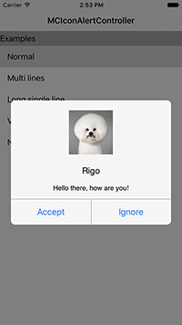

# MCIconAlertController
[](https://raw.githubusercontent.com/imegatron/MCIconAlertController/master/LICENSE)
[](https://github.com/Carthage/Carthage)
[](https://cocoapods.org/pods/MCIconAlertController)
[](https://cocoapods.org/pods/MCIconAlertController)
[](https://www.apple.com/nl/ios/)
[](https://travis-ci.org/imegatron/MCIconAlertController)
[](https://codecov.io/github/imegatron/MCIconAlertController?branch=master)
[](https://www.versioneye.com/objective-c/MCIconAlertController/references)

Alert controller with icon, have fun.




## Installation
### Cocoapods:

1. Add `pod 'MCIconAlertController', '~> 0.0.1'` to your Podfile.
2. Run `pod install` or `pod update`.
3. Import \<MCIconAlertController.h\>.

### Carthage:

1. Add `github "imegatron/MCIconAlertController"` to your Cartfile.
2. Run `carthage update --platform ios` and add the framework to your project.
3. Import \<MCIconAlertController/MCIconAlertController.h\>.

## Usage

```objc
MCIconAlertController *iconAlertController = [[MCIconAlertController alloc] init];
iconAlertController.iconImage = [UIImage imageNamed:@"dog.jpg"];
iconAlertController.title = @"Rigo";
iconAlertController.message = @"Hello there, how are you!";
iconAlertController.leftButtonTitle = @"Accept";
iconAlertController.rightButtonTitle = @"Ignore";
iconAlertController.leftButtonTappedBlock = ^(){
    NSLog(@"leftButtonTappedBlock");
};
iconAlertController.rightButtonTappedBlock = ^(){
    NSLog(@"rightButtonTappedBlock");
};
[iconAlertController show];
```

## Requirements
This library requires a deployment target of iOS 6.0 or greater.

## License
MCIconAlertController is provided under the MIT license. See LICENSE file for details.

