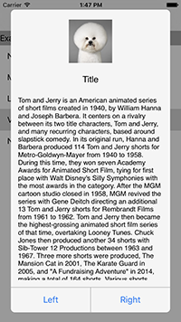

# MCIconAlertController
Alert controller with icon, have fun.





## Install
Cocoapods:
```
pod 'MCIconAlertController', '~> 0.0.1'
```

## Usage

```objc
MCIconAlertController *iconAlertController = [[MCIconAlertController alloc] init];
iconAlertController.iconImage = [UIImage imageNamed:@"dog.jpg"];
iconAlertController.title = @"Rigo";
iconAlertController.message = @"Hello there, how are you!";
iconAlertController.leftButtonTitle = @"Accept";
iconAlertController.rightButtonTitle = @"Ignore";
iconAlertController.leftButtonTappedBlock = ^(){
    NSLog(@"leftButtonTappedBlock");
};
iconAlertController.rightButtonTappedBlock = ^(){
    NSLog(@"rightButtonTappedBlock");
};
[iconAlertController show];
```


